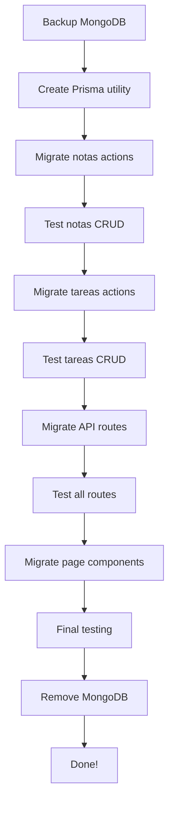

# 📊 Database Migration Plan: MongoDB → Prisma

**Date**: March 5, 2026
**Status**: Analysis Complete - Ready for Implementation

---

## 🎯 EXECUTIVE SUMMARY

### Current State: DUAL DATABASE ANTI-PATTERN

Your application currently uses **both MongoDB and Prisma** for the same entities, creating:

- **Data inconsistency risks**
- **Duplicated query logic**
- **Harder maintenance**
- **Performance overhead**

### Recommendation: **Migrate All to Prisma (Option A)**

✅ **Why Prisma?**

- All models already defined in `prisma/schema.prisma`
- Type safety with TypeScript
- Better performance with connection pooling
- Unified query interface
- Easy migrations with Prisma Migrate

---

## 📋 DATABASE AUDIT

### Prisma Models (Already Defined)

```prisma
✅ Carpeta       - 38 fields, complex relations
✅ Nota          - 8 fields, carpeta relation
✅ Task          - 9 fields, carpeta relation
✅ Factura       - 24 fields, emisor relation
✅ User          - 5 fields, authentication
✅ Actuacion     - 20+ fields, proceso relations
✅ Proceso       - 16 fields, juzgado relations
✅ Deudor        - 12 fields, carpeta relation
✅ Codeudor      - 6 fields, carpeta relation
✅ Demanda       - 20+ fields, complex relations
✅ Juzgado       - 4 fields, proceso relations
```

### MongoDB Collections (Currently in Use)

```javascript
// Database: "RyS"
- Carpetas collection  → Already in Prisma as Carpeta ⚠️
- Notas collection     → Already in Prisma as Nota ⚠️
- Tareas collection    → Already in Prisma as Task ⚠️
- Activas collection   → Test/dev data (safe to deprecate)

// Database: "Contabilidad"
- Facturas collection  → Already in Prisma as Factura ⚠️
```

**🚨 CRITICAL FINDING**: All MongoDB collections have equivalent Prisma models!

---

## 🔍 FILES USING MONGODB (Need Migration)

### **Priority 1: Server Actions** (7 files)

1. ✅ **src/app/actions/notas/create.ts** - Uses MongoDB
   - Lines 30-40: Direct MongoDB insert
   - **Migration**: Use `prisma.nota.create()`

2. ✅ **src/app/actions/notas/update.ts** - Uses MongoDB
   - Lines 28-35: Direct MongoDB update
   - **Migration**: Use `prisma.nota.update()`

3. ✅ **src/app/actions/notas/remove.ts** - Uses MongoDB
   - Lines 8-15: Direct MongoDB delete
   - **Migration**: Use `prisma.nota.delete()`

4. **src/app/notas/actions.ts** - Uses MongoDB
   - Export from collections
   - **Migration**: Use Prisma queries

5. **src/app/tareas/actions.ts** - Uses MongoDB
   - Uses `tareasCollection()`
   - **Migration**: Use `prisma.task` queries

### **Priority 2: API Routes** (4 files)

6. **src/app/api/Notas/route.ts** - MongoDB CRUD
   - GET: Fetch notas from MongoDB
   - POST: Create nota in MongoDB
   - **Migration**: Use Prisma client

7. **src/app/api/Carpeta/route.ts** - MongoDB CRUD
   - GET: Fetch carpeta from MongoDB
   - PUT: Update carpeta in MongoDB
   - **Migration**: Use Prisma client

8. **src/app/api/Pruebas/route.ts** - Test routes
   - Uses `carpetasCollection()`
   - **Can deprecate or migrate**

### **Priority 3: Page Components** (1 file)

9. **src/app/notas/fecha/[...date]/page.tsx** - Server component
   - Fetches notas by date from MongoDB
   - **Migration**: Use Prisma queries

### **Priority 4: Utilities** (2 files)

10. **src/lib/connection/collections.ts** - Collection helpers
    - All 5 functions can be **deprecated**
    - Replace with Prisma queries

11. **src/lib/christmas/helper.ts** - Christmas feature
    - Minor MongoDB usage
    - **Low priority**

---

## 🚀 MIGRATION STRATEGY

### Phase A: Preparation (1 hour)

- [x] **Audit complete** ✅
- [ ] Backup MongoDB databases
  ```bash
  mongodump --uri="<MONGODB_URL>" --out=./backup-$(date +%Y%m%d)
  ```
- [ ] Verify Prisma schema matches MongoDB structure
- [ ] Test Prisma connection
  ```bash
  npx prisma db pull  # Verify schema
  npx prisma generate # Generate client
  ```

### Phase B: Migration (4-6 hours)

#### Step 1: Migrate Server Actions (2 hours)

**File: src/app/actions/notas/create.ts**

```typescript
// BEFORE (MongoDB)
import clientPromise from '#@/lib/connection/mongodb';

export async function create(formData: FormData) {
  const client = await clientPromise;
  const db = client.db('RyS');
  const collection = db.collection('Notas');

  await collection.insertOne(nota);
}

// AFTER (Prisma)
import prisma from '#@/lib/prisma'; // Create this file

export async function create(formData: FormData) {
  await prisma.nota.create({
    data: nota,
  });
}
```

**Repeat for**:

- ✅ create.ts
- ✅ update.ts
- ✅ remove.ts

#### Step 2: Migrate API Routes (2 hours)

**File: src/app/api/Notas/route.ts**

```typescript
// BEFORE
const client = await clientPromise;
const notas = await client.db('RyS').collection('Notas').find().toArray();

// AFTER
const notas = await prisma.nota.findMany({
  include: { carpeta: true }, // Include relations if needed
});
```

#### Step 3: Migrate Page Components (1 hour)

**File: src/app/notas/fecha/[...date]/page.tsx**

```typescript
// BEFORE
const client = await clientPromise;
const notas = await client
  .db('RyS')
  .collection('Notas')
  .find({ createdAt: { $gte: startDate, $lte: endDate } })
  .toArray();

// AFTER
const notas = await prisma.nota.findMany({
  where: {
    createdAt: {
      gte: startDate,
      lte: endDate,
    },
  },
  include: { carpeta: true },
  orderBy: { createdAt: 'desc' },
});
```

#### Step 4: Create Prisma Utility (30 minutes)

**New File: src/lib/connection/prisma.ts**

```typescript
import { PrismaClient } from '@/app/generated/prisma';

const globalForPrisma = global as unknown as { prisma: PrismaClient };

export const prisma =
  globalForPrisma.prisma ||
  new PrismaClient({
    log:
      process.env.NODE_ENV === 'development'
        ? ['query', 'error', 'warn']
        : ['error'],
  });

if (process.env.NODE_ENV !== 'production') globalForPrisma.prisma = prisma;

export default prisma;
```

### Phase C: Testing (2-3 hours)

- [ ] Test Nota CRUD operations
  - Create new nota ✅
  - Update existing nota ✅
  - Delete nota ✅
  - List all notas ✅
  - Filter notas by date ✅

- [ ] Test Task operations
  - Create task ✅
  - Mark task complete ✅
  - List tasks by carpeta ✅

- [ ] Test Carpeta relationships
  - Get carpeta with notas ✅
  - Get carpeta with tasks ✅
  - Verify counts (notasCount) ✅

- [ ] Performance testing
  - Compare query times
  - Check connection pooling
  - Monitor memory usage

### Phase D: Cleanup (1 hour)

- [ ] Remove MongoDB dependencies
  ```bash
  pnpm remove mongodb
  ```
- [ ] Delete `src/lib/connection/collections.ts`
- [ ] Delete `src/lib/connection/mongodb.ts`
- [ ] Remove MongoDB connection string from `.env`
- [ ] Update documentation

---

## 📊 MIGRATION IMPACT ANALYSIS

### Risks & Mitigation

| Risk                          | Impact    | Mitigation                            |
| ----------------------------- | --------- | ------------------------------------- |
| Data loss during migration    | 🔴 HIGH   | Full MongoDB backup before starting   |
| Downtime during switchover    | 🟡 MEDIUM | Use feature flags for gradual rollout |
| Query performance differences | 🟢 LOW    | Prisma is typically faster            |
| Type mismatch errors          | 🟡 MEDIUM | Thorough TypeScript type checking     |

### Benefits

✅ **Immediate Benefits**:

- **Type Safety**: Full TypeScript support
- **No more "mongólico" errors**: Better error messages
- **Performance**: Connection pooling + query optimization
- **Maintainability**: Single source of truth
- **Developer Experience**: Better autocomplete

✅ **Long-term Benefits**:

- **Migrations**: Easy schema changes with Prisma Migrate
- **Testing**: Easier to mock Prisma than MongoDB
- **Scaling**: Better connection handling
- **Monitoring**: Built-in query logging

---

## 🎯 RECOMMENDED IMPLEMENTATION ORDER



---

## 💡 ALTERNATIVE: Progressive Migration

If full migration is too risky, consider:

### Option B: Abstraction Layer (Not Recommended)

Keep both databases but add abstraction:

```typescript
// src/lib/data/nota-repository.ts
export interface NotaRepository {
  create(nota: NotaInput): Promise<Nota>;
  update(id: string, nota: NotaInput): Promise<Nota>;
  delete(id: string): Promise<void>;
  findMany(filter: NotaFilter): Promise<Nota[]>;
}

// Choose implementation
const notaRepo: NotaRepository = USE_PRISMA
  ? new PrismaNotaRepository()
  : new MongoNotaRepository();
```

**Why not recommended**:

- More code to maintain
- Doesn't solve the core issue
- Still need to eventually pick one

---

## ✅ CHECKLIST FOR MIGRATION

### Pre-Migration

- [ ] Backup MongoDB databases
- [ ] Verify Prisma schema accuracy
- [ ] Create feature flag for gradual rollout
- [ ] Setup monitoring/logging

### During Migration

- [ ] Update server actions (notas, tareas)
- [ ] Update API routes
- [ ] Update page components
- [ ] Add comprehensive tests

### Post-Migration

- [ ] Verify all functionality works
- [ ] Monitor performance metrics
- [ ] Remove MongoDB dependencies
- [ ] Update deployment docs

---

## 📝 NOTES

- **Estimated Total Time**: 8-12 hours
- **Recommended Approach**: Dedicate a full day for migration
- **Rollback Plan**: Keep MongoDB backups for 30 days
- **Success Criteria**: All CRUD operations work via Prisma only

---

## 🚨 CRITICAL: Before Starting

1. **Backup all MongoDB data**
2. **Ensure Prisma schema is up to date**
3. **Have rollback plan ready**
4. **Inform team of scheduled migration**

---

_Generated by Code Review - Phase 5: Database Consolidation_
